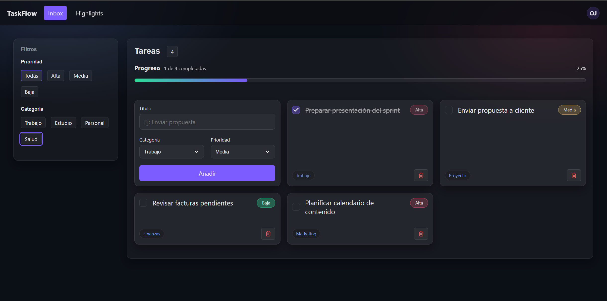
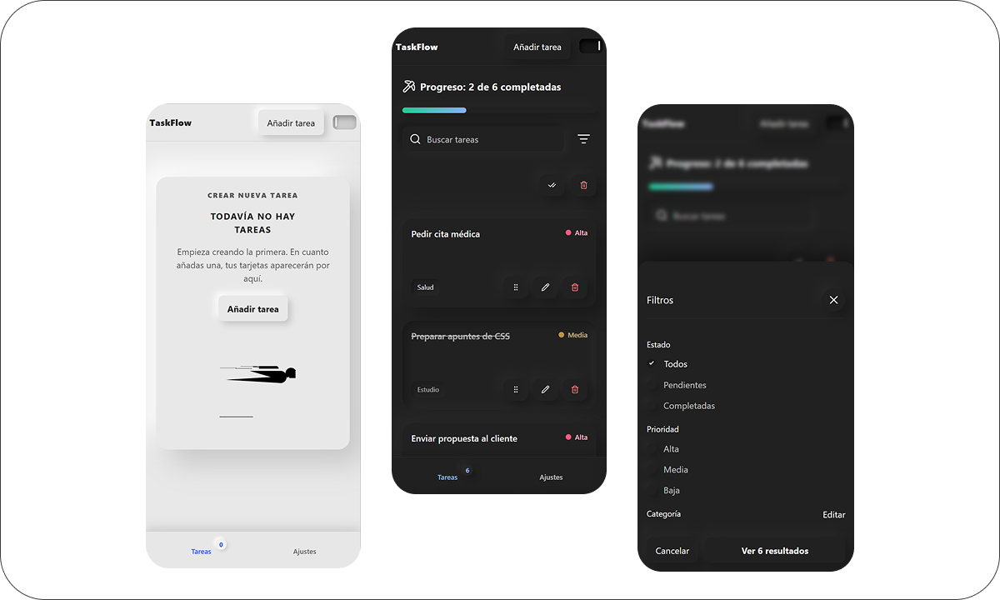

# taskflow-project

## Descripción de la app
ToDo app sencilla desarrollada con HTML, CSS y JavaScript. Permite crear, visualizar, completar y eliminar tareas. El proecto se dividira en partes, cada parte es la continuacion de las tareas marcadas por tutor de practicas.

## Capturas de pantalla

### Vista desktop

### Vista mobile

## taskflow-maqueta
Maqueta de TaskFlow en `index.html` usando `<header>`, `<main>`, `<aside>` y `<section>`, con variables CSS en `:root` para colores/espaciados y lista de tareas maquetada con Flex + transiciones.
Incluye Media Queries para que la barra lateral se reubique en móvil y el layout sea responsive.
Se ha añadido la librería de iconos Lucide para checks y botones (p. ej. borrar) y el proyecto se despliega en Vercel con URL pública.

## taskflow-js-dom

Interactividad con JavaScript y el DOM
Manipulación de elementos y persistencia local
Uso de JavaScript para transformar la página estática en una aplicación dinámica que responde a las acciones del usuario.

## Lógica principal de la app

### 1. Creación de tareas
La función `addTask()` valida que el título no esté vacío y crea una nueva tarea con la información introducida por el usuario. Después, genera el elemento HTML correspondiente, lo añade a la lista de tareas, limpia el campo de entrada y actualiza el identificador para la siguiente tarea.

### 2. Eliminación de tareas
Se utiliza `DOMContentLoaded` para asegurarse de que el DOM esté completamente cargado antes de trabajar con los elementos de la interfaz. La eliminación de tareas se gestiona mediante delegación de eventos sobre el contenedor de la lista, lo que permite que también funcionen correctamente las tareas añadidas de forma dinámica. Cuando el usuario pulsa el botón de borrar, se localiza la tarea correspondiente y se elimina de la interfaz.

### 3. Persistencia de datos
La persistencia se gestiona con `localStorage`. Cada vez que se añade, elimina o actualiza una tarea, el array de tareas se guarda usando `JSON.stringify()`. Al recargar la página, los datos almacenados se recuperan con `JSON.parse()` y la lista se reconstruye automáticamente en pantalla para mantener el estado anterior.

## Recursos utilizados

1. **JSON y forEach en JavaScript: Guardar y Recorrer Datos Como un Pro**  
   StudyCode Pro  
   https://studycodepro.com/blog/json-foreach-javascript-guardar-recorrer-datos-localstorage/

2. **How To Create To-Do List App Using HTML CSS And JavaScript | Task App In JavaScript**  
   YouTube  
   https://www.youtube.com/watch?v=G0jO8kUrg-I

3. **JavaScript: The Complete Crash Course**  
   YouTube  
   https://www.youtube.com/watch?v=OOOfBC1grl0

4. **How To Create A Search Bar In JavaScript**  
   YouTube  
   https://www.youtube.com/watch?v=TlP5WIxVirU

#### Pendiente
- Implementar un filtro de búsqueda que oculte las tareas que no coincidan con el texto introducido.
- Implementar un sistema de filtrado por categorías y prioridad.
- Implementar la lógica de la barra de progreso de las tareas.
